# Python 并发编程实战

本教程带你深入浅出理解并掌握 Python 并发编程。

## 简介

1. 为什么要引入并发编程？

并发就是为了提速！！

- 爬虫：从某网站下载图片，按顺序下载需要 1 小时，并发下载仅需要 1 分钟；
- Web：开发了一个网站，仅支持 100 人同时在线使用，增加并发后，支持 10 万人同时在线；
- 计算：根据数学公式计算一个值，原来需要 1 周的时间，增加并发后，1 小时就计算完成。

2. 有哪些程序提速的方法？

3. Python 对并发编程的支持

- 多线程：threading 模块利用 CPU 和 IO 可以同时执行的原理，提供了多线程编程支持；
- 多进程：multiprocessing 模块可以利用多核 CPU 的能力，实现真正意义上的并行；
- 异步 IO：asyncio 模块在单线程利用 CPU 和 IO 同时执行的原理，实现了函数异步执行。

此外，Python 还对上述并发编程提供了一些辅助性的函数和模块：

- Lock：对资源加锁，解决多线程/进程的冲突访问；
- Queue：实现不同线程/进程间的通信；
- Pool：实现了线程/进程池，简化任务提交、等待结束和获取结果的实现。
- Subprocess：启动外部程序的进程，并实现了输入输出交互。

## 教程

### Python 并发编程的三种方式

#### 

## 参考

> Python 并发编程实战[https://www.bilibili.com/video/BV1bK411A7tV]
